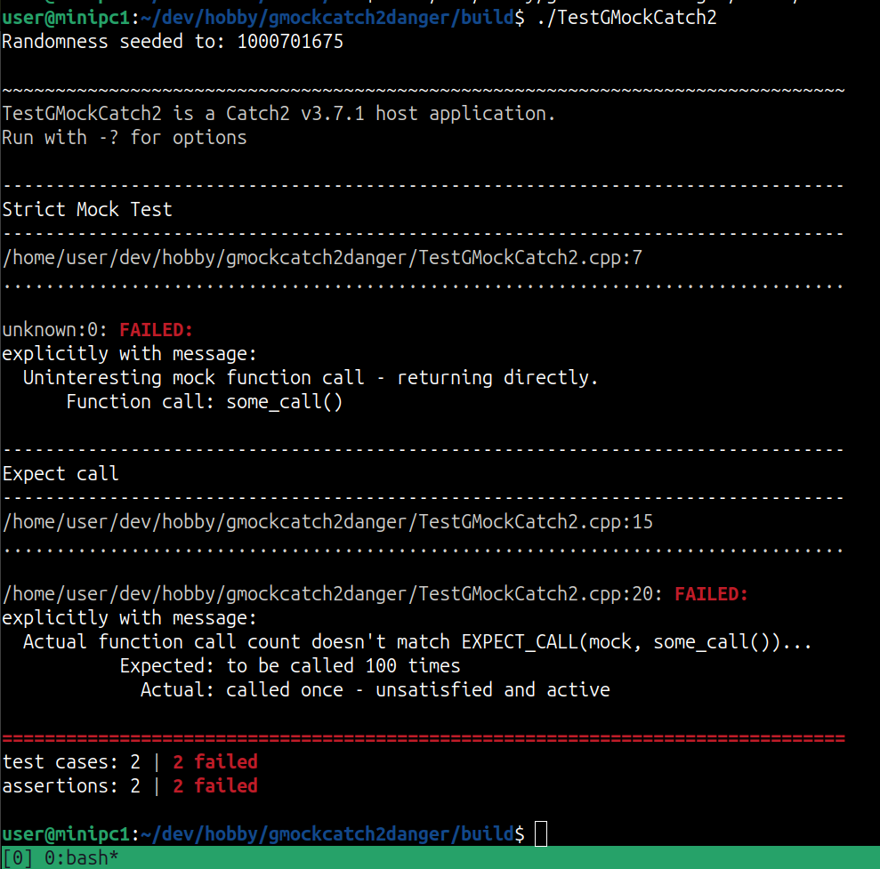

Hello World! In the [last post](https://asiltureli.github.io/2024/11/22/gmockcatch2danger) I talked about the possible pitfalls of combining Catch2 with GMock. In this post I will go through the solution to this problem.

# Possible solutions
If you stumbled upon this problem, you most probably made some research already. The useful result of this research for me was some [Stackoverflow entries](https://stackoverflow.com/questions/30485877/google-mock-and-catch-hpp-integration), an important [inspiring repository](https://github.com/matepek/catch2-with-gmock) and the [Google Mock docs](https://chromium.googlesource.com/external/github.com/google/googletest/+/refs/tags/release-1.8.0/googlemock/docs/ForDummies.md#using-google-mock-with-any-testing-framework). 

The Google Mock documentation already mentions the issue and provides two solutions. The first, less elegant solution is to configure Google Mock to throw exceptions on failures. For me there are two problems here. The first one is already mentioned: throwing exceptions from the mock object's destructor. The second problem (and question) is: what happens if I have multiple tests that fail in one section? Overall I directly passed that solution because the second one is way more beautiful.

The second solution suggests to use the Google Test's event listener API. As I was trying to implement the whole thing and digging into the source code of Catch2 and GMock, I realized [this repository](https://chromium.googlesource.com/external/github.com/google/googletest/+/refs/tags/release-1.8.0/googlemock/docs/ForDummies.md#using-google-mock-with-any-testing-framework) already provides an implementation. So. my rule of thumb is to skip reinventing the wheel. Instead, honor the original creator and seek ways to make their ideas even better.

# Overriding the GTest's EventListener class
The idea is very simple. GTest follows the well known [Observer Pattern](https://en.wikipedia.org/wiki/Observer_pattern) and it maintains a singleton instance called ```listeners```. This is a container to hold all listeners that are interested in a possible notification (error, warning etc.). When a notification arises, such as a failed test case, every listener is notified. In the next section I will deep-dive how this is achieved, but first a listener must be implemented, which connects the GMock/GTest and the Catch2. The goal of this listener is to create a Catch2 notification from the GMock notifications and pass it to Catch2. According to the [documentation](https://chromium.googlesource.com/external/github.com/google/googletest/+/refs/tags/release-1.8.0/googletest/docs/AdvancedGuide.md#defining-event-listeners) we must inherit a ```Listener``` from the ```EmptyEventListener``` class of GTest. ```EmptyEventListener``` is a great class, which provides virtual empty implementations for all EventListener methods, instead of leaving us with a dozen of pure virtual functions that are excited to be implemented. Therefore, we only need to implement the functions we need, which is in our case only ```OnTestPartResult```.As a starting point, here is the implementation of the custom listener from the owner of the mentioned [repository](https://github.com/matepek/catch2-with-gmock):

```cpp
class Listener : public testing::EmptyTestEventListener {
    void OnTestPartResult(const testing::TestPartResult& result) override {
      std::string filename = "unknown";
      size_t linenumber = 0;
      std::string message = "unknown";

      if (result.file_name() != nullptr)
        filename = result.file_name();

      if (result.line_number() != -1)
        linenumber = static_cast<std::size_t>(result.line_number());

      if (result.message() != nullptr)
        message = result.message();

      ::Catch::SourceLineInfo sourceLineInfo(filename.c_str(), linenumber);

      if (result.fatally_failed()) {
        ::Catch::AssertionHandler assertion("GTEST", sourceLineInfo, "",
                                            ::Catch::ResultDisposition::Normal);

        assertion.handleMessage(::Catch::ResultWas::ExplicitFailure, message);

        assertion.complete();
      } else if (result.nonfatally_failed()) {
        ::Catch::AssertionHandler assertion(
            "GTEST", sourceLineInfo, "",
            ::Catch::ResultDisposition::ContinueOnFailure);

        assertion.handleMessage(::Catch::ResultWas::ExplicitFailure, message);

        assertion.complete();
      }
    }
  };

```

It has some problems which we will be fixing but it is a great starting point. The code is very understandable: GTest notifies us with a ```TestPartResult& result``` which contains information like file name, line number and the message. Depending on the error type we create either a ```Normal``` assertion or a ```ContinueOnFailure``` assertion and process it in a Catch2-way. But what are the problems in that code? There are two problems, one of them is obvious and the second one is a very sneaky one (Hint: const char*). 

1. The code only works for Catch2 v2. It required some adaptations for different versions. For example ```assertion.setCompleted()``` is from major version 2, which is changed to ```assertion.completed()``` in the version 3. Or another issue is that ```assertion.handleMessage``` is expecting the message as an r-value reference starting from the version [v3.7.1](https://github.com/catchorg/Catch2/releases/tag/v3.7.1) with the [related commit](https://github.com/catchorg/Catch2/commit/412cad546a89cda9eaa8ef77d8161b719182cc9e). This code must be tested and adapted for each Catch2 version.
2. This is actually a very hard to see issue. The problem is at the constructor of the ```AssertionHandler```. We create a local variable ```filename``` and pass the ```const char*``` of that variable to the constructor. However we don't have any information what ```assertion``` is doing with our pointer. Eventually the usage might outlive the ```filename```. The solution for this is to create a member-container that holds the ```filename``` for each notification. This way we can assure that the string is always there, since the listener is destroyed at the end of the program.

After solving these issues our code looks like the following:

```cpp
class Listener : public testing::EmptyTestEventListener {

   std::set<std::string> m_file_names; // Solution to 2.

  void OnTestPartResult(const testing::TestPartResult& result) override
  {
    std::string filename = "unknown";
    size_t linenumber = 0;
    std::string message = "unknown";

    if (result.file_name())
      filename = result.file_name();

    if (result.line_number() != -1)
      linenumber = static_cast<std::size_t>(result.line_number());

    if (result.message())
      message = result.message();

    auto [it, _] = m_file_names.insert(filename); // Solution to 2.
    ::Catch::SourceLineInfo sourceLineInfo(it->c_str(), linenumber); // Solution to 2.

    if (result.fatally_failed()) {
      ::Catch::AssertionHandler assertion(
        "GMock", sourceLineInfo, "", ::Catch::ResultDisposition::Normal);

      assertion.handleMessage(::Catch::ResultWas::ExplicitFailure,
                              std::move(message)); // Solution to 1.

      assertion.complete(); // Solution to 1.
    } else if (result.nonfatally_failed()) {
      ::Catch::AssertionHandler assertion(
        "GMock",
        sourceLineInfo,
        "",
        ::Catch::ResultDisposition::ContinueOnFailure);

      assertion.handleMessage(::Catch::ResultWas::ExplicitFailure,
                              std::move(message)); // Solution to 1.

      assertion.complete(); // Solution to 1.
    }
  }
};

```

The changes we apply include adding the ```m_file_names``` variable, the version specific ```assertion.complete``` and the changed signature of the ```assertion.handleMessage``` function. Be aware that this signature is only valid starting from v3.7.1.

# Adding the custom Listener to the GTest's listeners
In the last section we created our own GTest listener, which will notify the Catch2 about the failing GMock checks. But we also need to make sure that GTest knows that we want him to notify our listener instead of some other listener object. For this purpose we will replace the default GTest listener with our listener. Here is a ```main``` that would solve this problem according to the [event listener API](https://chromium.googlesource.com/external/github.com/google/googletest/+/refs/tags/release-1.8.0/googletest/docs/AdvancedGuide.md#using-event-listeners) : 
```cpp
int main(int argc, char** argv)
{
  Catch::Session session;
  InitGoogleMock(&argc, argv);

  TestEventListeners& gtest_listeners = UnitTest::GetInstance()->listeners();
  gtest_listeners.Append(new GTestCatch2Listener());
  delete gtest_listeners.Release(
    UnitTest::GetInstance()->listeners().default_result_printer());

  return session.run(argc, argv);
}
```

This code achieves a very simple task. It deletes the default listener from GTest, attaches our custom listener and passes the command line arguments to GMock and Catch2. With this main and the listener it is now safe to combine GMock and Catch2. We can verify this with a new test:


# Summary

If you have made so far, thank you for reading. In this post I introduced a way to connect GMock and Catch2. However it is still not the best solution. In the next post I will be creating a library which acts as ```Catch2WithMain``` which provides a pre-compiled ```main``` and works correctly with GMock. This way we will be able to use GMock and Catch2 only by linking against this new library. The code for this post can be found [here](https://github.com/asiltureli/GMockWithCatch2) Cheers.
