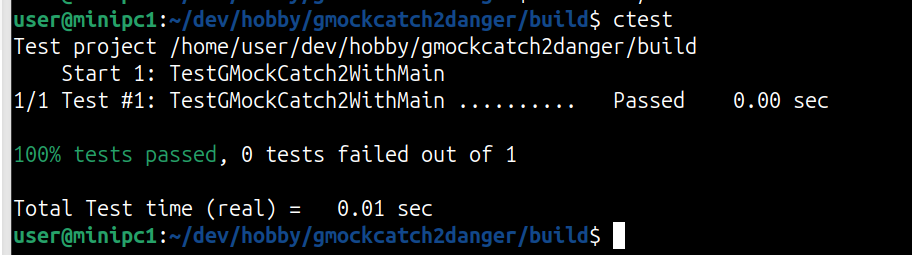
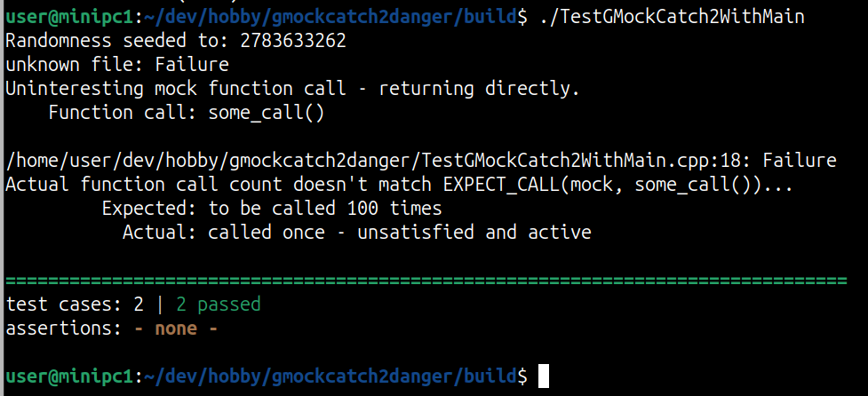

Recently I stumbled upon a problem at work while writing unit tests. The unit tests I wrote were not failing even though they were supposed to fail. At first, I thought I had made a mistake in my mock classes, but the issue turned out to be completely different.

Catch2 is a great BDD (Behavior Driving Development) framework for C++, however it lacks a main functionality; Mocking. Therefore it would be useful to deploy GMock at this point. However this comes with a great danger. In this post I want to write about the danger and possible pitfall of combining GMock with Catch2 or possibly any other unit testing framework. 

One might thing: why not GoogleTest? The question is understandable but GTest does not offer BDD. It is designed to write TDD tests. Therefore it is a combination, which makes completely sense. 

I will share the complete code in my repository.

## Writing a very basic mock

Let's start with a very basic class and the mock for this class:

```cpp
class ClassToTest{
public:
    virtual void some_call(){};
};


class MockClass : public ClassToTest{
public:
    MOCK_METHOD(void, some_call, (), (override));
};
```

This should be pretty straightforward. We have a class we want to test, ```ClassToTest```, and the corresponding mock class,  ```MockClass```. Now, let's add a caller for that class:

```cpp
class SimpleWrapper{
public:
    SimpleWrapper() = delete;
    SimpleWrapper(ClassToTest& sc) : m_obj { sc }{};
    void call(){m_obj.some_call();};
private:
    ClassToTest& m_obj;
};
```

Now we are ready to test our class.

## Writing and running some tests in Catch2

In this phase we can write some tests to check our class with Catch2. Here are some very minimal tests:

```c++
using namespace ::testing;
TEST_CASE("Strict Mock Test")
{
    auto mock = StrictMock<MockClass>();
    auto caller = SimpleWrapper(mock);

    caller.call();
}

TEST_CASE("Expect call")
{
    auto mock = NiceMock<MockClass>();
    auto caller = SimpleWrapper(mock);

    EXPECT_CALL(mock, some_call()).Times(100);
    caller.call();
}
```
In the first test case we define a ```StrictMock``` and don't set any expectations. However we call our function through our ```SimpleWrapper```. The strict mock should report us the unexpected e.g. uninteresting call as an error. Therefore this is obviously a failed test case.  

In the second test case, we define a ```NiceMock```, which doesn`t affect our test case in terms of unexpected calls. The goal here is to set an expectation on ```some_call```. We expect that our function gets called 100 times within this scope. However, we call it only once. This is, again, an obvious failed test case.

## Running the test
Lets run our tests, which should obviously fail:



This result is interesting and not what we would expect or want. Let's simple run and see the output of our executable:



The result is still the same however we can see that something is odd. Here's what happens: we are using the precompiled ```main()``` of Catch2, which simply looks something like:

```cpp
// Simplified from catch2/src/catch2/internal/catch_main.cpp
int main (int argc, char * argv[]) {
    return Catch::Session().run( argc, argv );
}
```
That means we are getting the result of our tests from ```Catch2::Session```. However the question is: does Catch2 recognize that GMock/GTest expressions are failing? The answer is **NO!**. The tests that are being conducted by Googletest must be passed to the Catch2. And Googletest developers have addressed this issue: 

https://chromium.googlesource.com/external/github.com/google/googletest/+/refs/tags/release-1.8.0/googlemock/docs/ForDummies.md#using-google-mock-with-any-testing-framework

TLDR: If you want to use GMock with other testing frameworks, it must be fine-tuned.

This issue is pretty obvious and straightforward after reading about it or figuring it out. However, it's a really painful problem that will most likely cause someone to spend days trying to understand what's happening without knowing the root cause.

## Summary
  Catch2 and GMock together form a very strong testing combination. However they do not work together out of the box. This might trick you into pushing a buggy code into the production.

  Thank you for reading. In the next post, I will go into detail on how to solve this issue.

